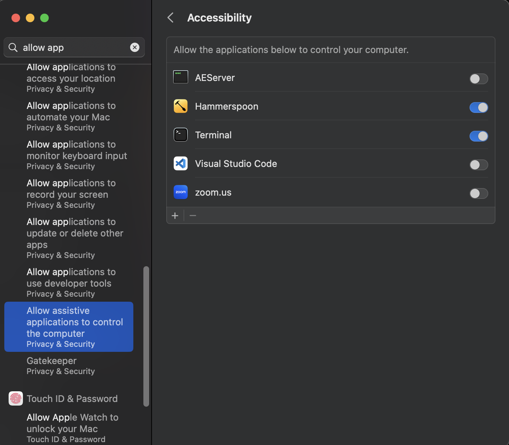

# delayed-string-typer
Script to type string in the active window with a delay

## Preparing

It's a python3 script.
Install dependencies:

```
python -m pip install -r requirements.txt
```

On MacOS, when running the first time, ensure that the permission for the terminal to gain control of the keyboard is enabled



## Running
- By default, without any CLI arguments it will hide the string to type, and wait 5 seconds
- Optional args:
    - `--wait`, `-w` wait time before keypress emulation begins
    - `--kbstr`, `-s` string to emulate keypress on

<br/>

